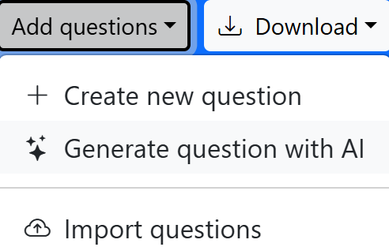
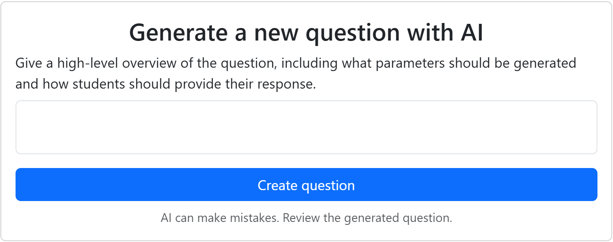
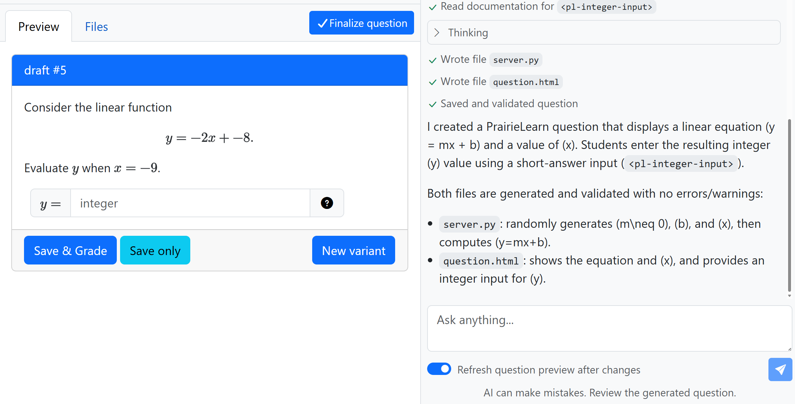
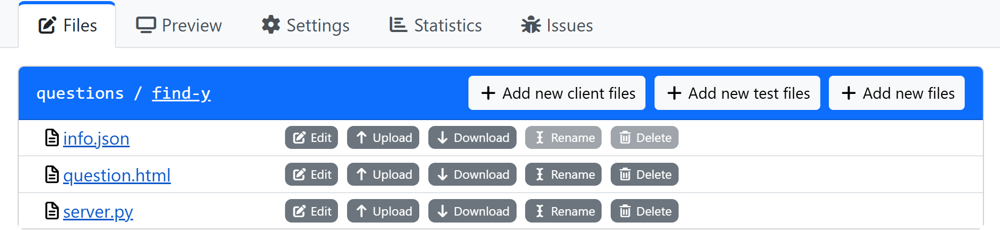
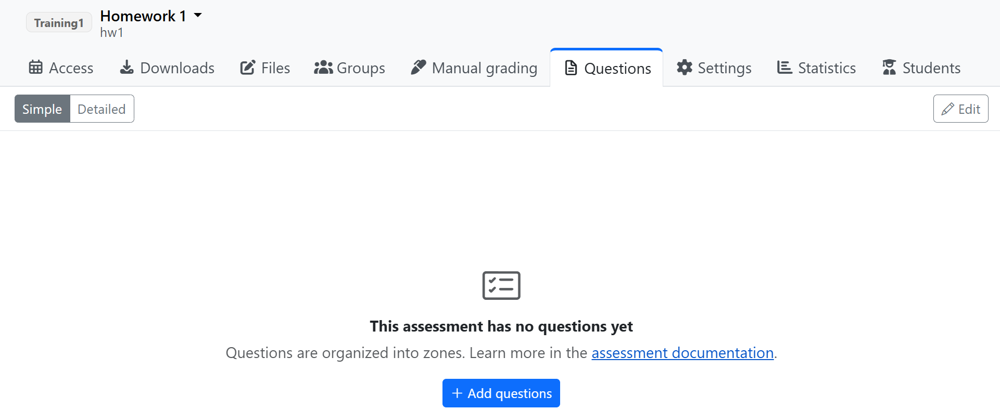
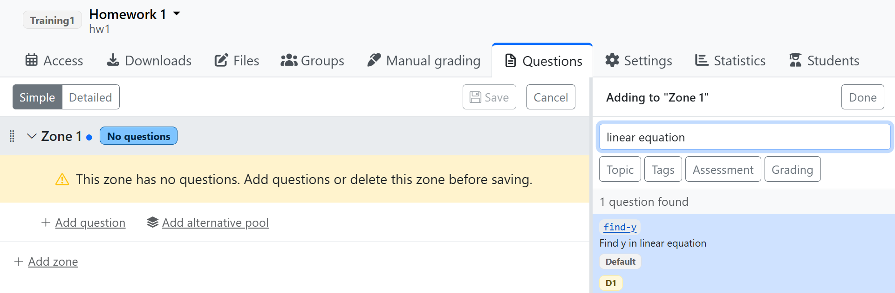

Once you [gain access to PrairieLearn](index.qmd#access), read the following sections describing first steps for working with its web interface.

## Making Your First PrairieLearn Question {#question}

### Entering an AI Prompt

Log in to the [PrairieLearn course site](https://us.prairielearn.com/) and navigate to your course. Click on "Questions" in the left sidebar. Then click the "Add questions" drop-down and choose "Generate question with AI", as shown below:

{width=200px fig-align="center" fig-alt="The \"Add questions\" dropdown menu, open to show three options: \"Create new question,\" \"Generate question with AI,\" and \"Import questions.\""}

You should then see the option to type your prompt:

{fig-align="center" fig-alt="The \"Generate question with AI\" page, showing a text box for entering a prompt."}

Enter whatever details of a question you'd like. For a simple first example, you might consider: "Show a randomly generated linear equation and a random x value. Students must enter (short-answer) the resulting y value." Click "Create question". The AI will process for a bit (in the right panel of the page) and then generate a question you can try out in the "Preview" tab on the left, as shown below:

{fig-align="center" fig-alt="The \"Preview\" tab of a generated question, showing draft #5, a linear-equation question with an answer box for the y value, alongside a chat panel where the AI describes the server.py and question.html files it created and validated."}

### Adjusting the Question with AI

With the initial draft question generated, you can chat with the AI in the "Ask anything..." box, to adjust the question as needed. When you are satisfied with the question, click "Finalize question". Give it a title (student-facing) and a QID (question ID). The QID must be unique within your course. Click "Finalize question" again.

### Changing the Question After Creation

Click on the "Questions" tab in the left sidebar, and click the link for the question you just made. It will open in the "Preview" tab, where you can try it out again. Click on the "Settings" tab for the question and note what options are available.

Next, check out the "Files" tab. You'll see that there are three files that fully define everything about your question: how it's presented to students, how any randomness is handled, how it's graded, etc. 

{fig-align="center" fig-alt="The \"Files\" tab of a generated question, showing the three files that define the question."}

Each file can be edited by clicking the "Edit" button next to it. Be certain that you click the "Save" button when you're finished with any edits. The files use special formats (JSON, HTML, and Python), but don't worry, you can manage just fine without any experience in these formats.

Consider the three files:

- `info.json` - defines basic settings for the question, in JSON format.
  - There is no need to manually edit `info.json` in most cases. You can instead adjust the file via the options in the "Settings" tab. Any changes you make in "Settings" will be reflected in `info.json`, and vice versa.
- `question.html` - defines how the question is presented to students.
  - This file is in HTML syntax, with special notation for PrairieLearn. If you know HTML, you might choose to hand-edit this file on occasion, but I will also explain an easier option next.
- `server.py` - determines how the question is generated and graded.
  - This file is written in the Python programming language. Most users will probably not want to bother hand-editing the Python code.

For most users, the best option for editing a question will be to use AI. You can use AI extensively with the [repository interface](github-repo.qmd) (highly recommended!), but for now, let's consider how to use AI while working only with the web interface. Unfortunately, the web interface does not yet have a built-in AI chat feature for editing questions, only creating them. Thus, one option for editing is to paste back and forth with a chat AI, such as [U-M GPT](https://umgpt.umich.edu/).

You might consider a prompt along these lines (select and copy the text below):

> PrairieLearn question. question.html and server.py are pasted below. [describe changes in plain English - no code details needed]
>
> Update and return the COMPLETE question.html and server.py files (not fragments) as raw text boxes so that I can easily copy and paste. Ask me questions as needed.
>
> question.html:\
> [paste the question.html file here]
>
> server.py:\
> [paste the server.py file here]

For each file, copy from the AI response, choose "Edit" for the file in PrairieLearn, paste in the content, and click "Save". Try the question out and repeat with AI as needed. Of course, in some cases you may want to have a longer conversation with AI, sharing your learning goals for the question, target difficulty level, etc.

## Making Your First Assessment

In PrairieLearn, an "assessment" is a collection of questions that students will answer. There are two types of assessments, "Homework" and "Exam". The type determines some default settings, but these can be adjusted anytime. When you're ready to make an exam to be administered in the ETF, you'll make an assessment of type "Exam" and then follow [ETF](https://etf.engin.umich.edu/) procedures.

### Creating an Empty Assessment

To make your first assessment, click on "Assessments" in the left sidebar. Then click the "Add assessment" button. Let's give it the title "Homework 1", short name "hw1", set the type to "Homework", and the "set" to whatever you'd like. (You can also edit the available assessment sets in Course Settings, Assessment Sets.) Press the "Create" button.

### Adding Questions to the Assessment

You'll see your new assessment's page:

{fig-align="center" fig-alt="The empty assessment page, showing no questions yet."}

There are no questions in it yet, so click "+ Add questions". You'll see "Zone 1" in the left panel, and a list of your questions in the right panel. Find the question you wish to add, using the search box if needed:

{fig-align="center" fig-alt="Adding a question to the assessment. The left panel shows Zone 1, and the right panel shows the desired question, found with a search box."}

Click on the box around the question (not the blue underlined link itself) to add it to the assessment. Hit the blue disk icon button (labeled "Save" on hover) to save, and you'll be back in your Assessment main page.

Go back to the Questions page and make a few more questions, so that you have a few to try out the assessment functionality with. Then add them to your assessment. You can add as many questions as you like, and you can also adjust the order of questions by dragging and dropping them in the left panel of the "+ Add questions" page.

### Configuring Student Access

Next, we need to configure when and how students access the assessment. The steps for this depend on whether the assessment is an exam to be taken in the ETF, or any task for outside of the ETF (homework, take-home exam, etc.).

For exams to be taken in the ETF, you will need to follow [ETF](https://etf.engin.umich.edu/) procedures. This page will be updated with a more direct link soon, once it's ready. <!-- TO DO update with link -->

For other kinds of assessments, click on the "Access" tab of the assessment. Feel free to explore the options available, and also note the [full PrairieLearn documentation](https://docs.prairielearn.com/assessment/accessControl/) on access settings.

### Exploring the Assessment

When looking at your assessment page, you can try it out as a student will see it by clicking on your name in the upper-right corner and choosing "Student view without access restrictions".

When you're done exploring it, go back to the regular view (upper-right corner, "Staff view"). Click the other tabs at top to explore what's possible, such as the "Access" tab, "Files", "Manual grading", "Settings", etc.

Note that the "Files" tab lists only `infoAssessment.json`. There is no need to manually edit this file in most cases. You can instead adjust the file via the options in the "Settings" tab. Any changes you make in "Settings" will be reflected in `infoAssessment.json`, and vice versa.

## Importing Content from Canvas

If you have quizzes on Canvas that you'd like to import into PrairieLearn, there is a convenient way to do that. For details, visit the official documentation on [Importing content from other platforms](https://docs.prairielearn.com/importingContent/).

## Next Steps

For further examples of question generation, you may find this [Engineering Education Innovation day presentation](https://drive.google.com/drive/u/0/folders/15-LHxlP8fdFuVQwbnK4clguFPSfcxAfV) by Laura Alford and Steven Bogaerts to be useful. It includes illustration of question generation through both the [web interface](web-interface.qmd) and the [repository interface](github-repo.qmd).

Next, see the [Allowing a Reference Sheet in an Exam](reference-sheets.qmd) page for letting students access reference sheets during an assessment, or move on to the [Making Content via the Repository Interface](github-repo.qmd) page if you're ready to work with PrairieLearn via a Git repository.
  